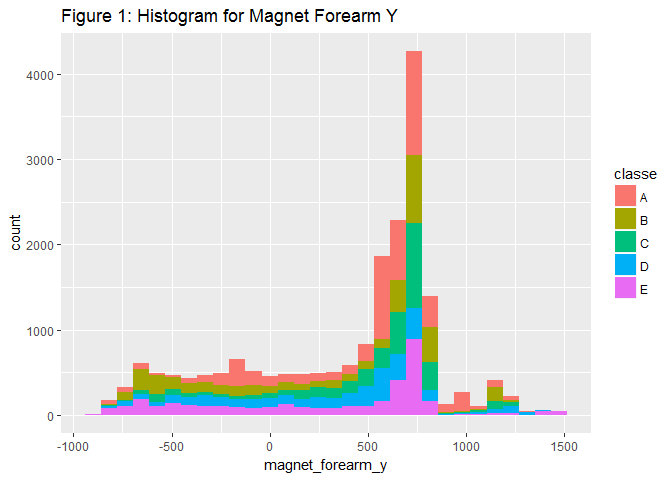
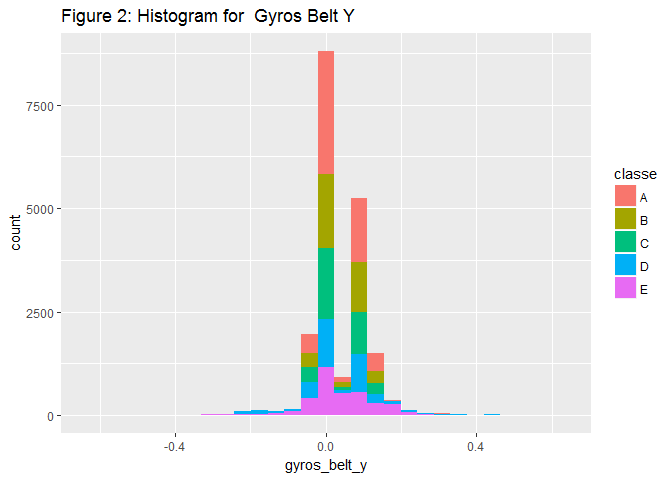
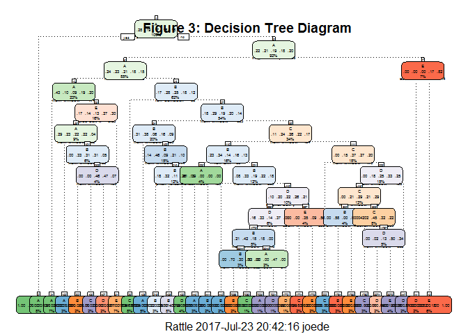

# Prediction Project
Joe DeMaio  
### Date: 2017-07-23

## Background

Using devices such as Jawbone Up, Nike FuelBand, and Fitbit it is now possible to collect a large amount of data about personal activity relatively inexpensively. These type of devices are part of the quantified self movement - a group of enthusiasts who take measurements about themselves regularly to improve their health, to find patterns in their behavior, or because they are tech geeks. One thing that people regularly do is quantify how much of a particular activity they do, but they rarely quantify how well they do it. In this project, your goal will be to use data from accelerometers on the belt, forearm, arm, and dumbell of 6 participants. They were asked to perform barbell lifts correctly and incorrectly in 5 different ways. More information is available from the website here: http://groupware.les.inf.puc-rio.br/har (see the section on the Weight Lifting Exercise Dataset).

## Loading the Data

The training and test data sets for this assignment are available here:
  
    
Training:
https://d396qusza40orc.cloudfront.net/predmachlearn/pml-training.csv
  
  
Testing: 
https://d396qusza40orc.cloudfront.net/predmachlearn/pml-testing.csv


```r
# clear out the memory
rm(list = ls())
# Here we create the file path and download the files:
if(!file.exists("./data"))
{
    dir.create(file.path("./data"))
}
if(!file.exists("./data/traindat.csv"))
{
    trainingURL <- "https://d396qusza40orc.cloudfront.net/predmachlearn/pml-training.csv"
    download.file(trainingURL, destfile = "./data/traindat.csv")
}
# Files are then loaded into R studio
training <- read.csv("./data/traindat.csv")
testing <- read.csv("./data/testdat.csv")
```
## Building the Model
Loading the data we see that the training data set has 160 variables. The variables of interest for this purpose would be the ones enough variability.   
  
### Building the model - Part 1.
In the first part of building the model I removed the columns with NA's. Then I chose only numeric columns and I eliminted time stamp variables.

```r
#Find columns without NA's
No_NAs <-sapply(training, function(y) sum(is.na(y))==0) 

# Find the numeric columns
nums <- sapply(training, is.numeric)
nums[1]=FALSE  # eliminate line numbers
nums <- nums & No_NAs & !grepl("timestamp", names(training)) # Eliminate timestamps

#cleaned training dataset
training_clean <- training[,nums]
```

### Building the model - Part 2
In this next portion of building the model I removed from the any variables with a near-zero variance using the nearZeroVar function.  As it turned out, there were no variables with a near-zero variance using this function.

```r
#remove data where variance close to zero
nZVar= nearZeroVar(training_clean[sapply(training_clean, is.numeric)],
                   saveMetrics = TRUE)
training_clean <- training_clean[,!nZVar$nzv]
dim(training_clean)
```

```
## [1] 19622    53
```

Next I made a dataframe of the remaining variables and their variances.

```r
varTable <-sapply(training_clean, function(y) var(y)) 
varDf <- as.data.frame(varTable)
names(varDf)[1] <- "variance"
varDf <- mutate(varDf, variable = rownames(varDf))
varDf <- arrange(varDf, desc(variance))
varDf <- varDf[,2:1]
```
### Histograms of the remaining variables with highest and lowest variance

To explore the variance of the data set, I plotted histograms of the variables with the highest(magnet_forearm_y) and lowest(x=gyros_belt_y) variances.

```r
names(varDf)[1] <- "varName"
varDf[varDf$variance== max(varDf$variance),] 
```

```
##            varName variance
## 1 magnet_forearm_y 259461.6
```

```r
varDf[varDf$variance== min(varDf$variance),] 
```

```
##         varName    variance
## 53 gyros_belt_y 0.006120797
```

```r
training_clean <- mutate(training_clean, classe = training$classe)
g <- ggplot(data=training_clean, aes(x=magnet_forearm_y, fill=classe))
g <- g + geom_histogram()+ggtitle("Figure 1: Histogram for Magnet Forearm Y")
g
```

<!-- -->

```r
g <- ggplot(data=training_clean, aes(x=gyros_belt_y, fill=classe))
g <- g + geom_histogram()+ggtitle("Figure 2: Histogram for  Gyros Belt Y")
g
```

<!-- -->
These histograms indicate that there is enough sample variability in all the remaining variables.

### Building the model - Part 3
#### Preparing the dataset
The first thing in preparing the dataset is to remove the variables with high correlation.  Variabeles with high correlation are redundant and lead to excess processing. I use 0.5 as a cutoff. I will eleminate any variable with a correlation value of greater than 0.5.

```r
corMatrix <- cor(training_clean[,1:53])  # Make a correlation matrix
highCorr <- findCorrelation(corMatrix, cutoff=0.5)  # find the high correlations
training_clean <- training_clean[,-highCorr] #remove variables with high correlation.
```
This leaves 23 variables.
   
   
Next I divide the training data into training and validation.  I use 80% for trauing and 30% for validation.

```r
set.seed(4567)
inTrain <- createDataPartition(y=training_clean$classe, p=0.7, list = FALSE)
myTraining <- training_clean[inTrain,]
myValidation <- training_clean[-inTrain,]
```
## Decision Tree
The first method I tired is the decision tree:

```r
#Do the decision tree on the training portion
set.seed(1234)
# Start the clock!
ptm <- proc.time()
modDTFit <- rpart(classe ~ ., data=myTraining, method="class")
# Stop the clock
etm1 <- proc.time() - ptm
library(rattle)
fancyRpartPlot(modDTFit, cex=.4,under.cex=1,shadow.offset=0, main ="Figure 3: Decision Tree Diagram")
```

<!-- -->

```r
prediction <- predict(modDTFit, newdata = myValidation, type = "class")
cfdt <- confusionMatrix(prediction,myValidation$classe)
cfdt
```

```
## Confusion Matrix and Statistics
## 
##           Reference
## Prediction    A    B    C    D    E
##          A 1486   48    0    0   19
##          B  106  942   75   54   53
##          C   62   92  896   30   10
##          D   19   40   11  693   63
##          E    1   17   44  187  937
## 
## Overall Statistics
##                                          
##                Accuracy : 0.8418         
##                  95% CI : (0.8322, 0.851)
##     No Information Rate : 0.2845         
##     P-Value [Acc > NIR] : < 2.2e-16      
##                                          
##                   Kappa : 0.8003         
##  Mcnemar's Test P-Value : < 2.2e-16      
## 
## Statistics by Class:
## 
##                      Class: A Class: B Class: C Class: D Class: E
## Sensitivity            0.8877   0.8270   0.8733   0.7189   0.8660
## Specificity            0.9841   0.9393   0.9601   0.9730   0.9482
## Pos Pred Value         0.9569   0.7659   0.8220   0.8390   0.7901
## Neg Pred Value         0.9566   0.9577   0.9729   0.9464   0.9691
## Prevalence             0.2845   0.1935   0.1743   0.1638   0.1839
## Detection Rate         0.2525   0.1601   0.1523   0.1178   0.1592
## Detection Prevalence   0.2639   0.2090   0.1852   0.1404   0.2015
## Balanced Accuracy      0.9359   0.8832   0.9167   0.8459   0.9071
```
The Decision Tree gives an 84.2% accuracy prediction rate.

## Random Forest
The second method I tried was Random Forest.  New training and validation test sets were produced.

```r
set.seed(6789)
inTrain <- createDataPartition(y=training_clean$classe, p=0.7, list = FALSE)
myTraining <- training_clean[inTrain,]
myValidation <- training_clean[-inTrain,]
ptm <- proc.time()
modRF <- randomForest(classe ~., data=myTraining, type="class")
# Stop the clock
etm2 <- proc.time() - ptm
predictRF <- predict(modRF, newdata = myValidation)
cfrf <- confusionMatrix(predictRF, myValidation$classe)
cfrf  
```

```
## Confusion Matrix and Statistics
## 
##           Reference
## Prediction    A    B    C    D    E
##          A 1674    2    0    0    0
##          B    0 1133    4    0    2
##          C    0    4 1022   12    0
##          D    0    0    0  951    4
##          E    0    0    0    1 1076
## 
## Overall Statistics
##                                           
##                Accuracy : 0.9951          
##                  95% CI : (0.9929, 0.9967)
##     No Information Rate : 0.2845          
##     P-Value [Acc > NIR] : < 2.2e-16       
##                                           
##                   Kappa : 0.9938          
##  Mcnemar's Test P-Value : NA              
## 
## Statistics by Class:
## 
##                      Class: A Class: B Class: C Class: D Class: E
## Sensitivity            1.0000   0.9947   0.9961   0.9865   0.9945
## Specificity            0.9995   0.9987   0.9967   0.9992   0.9998
## Pos Pred Value         0.9988   0.9947   0.9846   0.9958   0.9991
## Neg Pred Value         1.0000   0.9987   0.9992   0.9974   0.9988
## Prevalence             0.2845   0.1935   0.1743   0.1638   0.1839
## Detection Rate         0.2845   0.1925   0.1737   0.1616   0.1828
## Detection Prevalence   0.2848   0.1935   0.1764   0.1623   0.1830
## Balanced Accuracy      0.9998   0.9967   0.9964   0.9929   0.9971
```
The Random Forest method gives about a 99.5% accuracy prediction rate. Since Random Forest gives such a near perfect accuracy, I will use Random Forest to predict the test data set.

## Expectation vs Outcome
Generally speaking, I would expect the Random Forest prediction to be more accurate for the following reasons:

1.  Samples are Bootstrapped 

2.  At each split, the variables are also bootstrapped

3.  Multiple trees are "grown" and the result is taken from those multiple trees.
    
    
However, all of this extra processing takes more time.  I would expect the Random Forest prediction to take considerably more time.  
  
  
Indeed I fonund that that the Random Forest method, at 99.5%  , was more accurate than the Decision Tree method at 84.2% . This is to be expected. 

I also found that processing for Decision Tree took 1.09 seconds, while the Random Forest took 17.14 seconds, or about 16 times longer. This is also as expected.
  
  
## Final Prediction
Here I develop the prediction using the entire trianing set.  

```r
#do random forest on entire training set
modRF_All <- randomForest(classe ~., data=training_clean, type="class")
predictFinal <- predict(modRF_All, newdata = training_clean)

# Prepare test set
ftrsUsed <- names(training_clean)[1:22]  # use only those columns in the training data set
test_used <- testing[,ftrsUsed]
predFinal <- predict(modRF_All, newdata = test_used, type="class")
```
The results for the predition are not output, but it resulted in a score of 100% on the quiz.
  
  
## Discussion
There is an obvious trade off between selecting more accurate methods for prediction and cycle time.  Where accuracy is more critical one might want to use the method that uses more computer cycles and is more accurate. In determining spam, for example, a user might get a little annoyed at an algorithm that let through 20% of the spam, or have 20% of important email go to spam.  On the other hand, a movie rental company might not want to waste the computer cycles, and an 80% success rate in selecting suggestions for a user might be acceptable.

## References
#### R.Bloggers
##### Trees with the rpart Package
https://www.r-bloggers.com/trees-with-the-rpart-package/

####Package "Random Forest"
https://cran.r-project.org/web/packages/randomForest/randomForest.pdf

#### TEX
##### Suppress library comments from output with knitr
https://tex.stackexchange.com/questions/152488/suppress-library-comments-from-output-with-knitr

#### Cookbook for R 
##### Plotting distributions (ggplot2)
http://www.cookbook-r.com/Graphs/Plotting_distributions_(ggplot2)/

#### R Documentation
##### Arrange
https://www.rdocumentation.org/packages/dplyr/versions/0.7.1/topics/arrange

#### R Documentation
##### Format
https://www.rdocumentation.org/packages/base/versions/3.4.1/topics/format

#### Stack Overflow
##### means and SD for columns in a dataframe with NA values
https://stackoverflow.com/questions/20794284/means-and-sd-for-columns-in-a-dataframe-with-na-values

#### knitr in a knutshell
##### Knitr with R Markdown
http://kbroman.org/knitr_knutshell/pages/figs_tables.html
  
  
#### Statistical tools for high-throughput data analysis
http://www.sthda.com/english/wiki/ggplot2-title-main-axis-and-legend-titles
